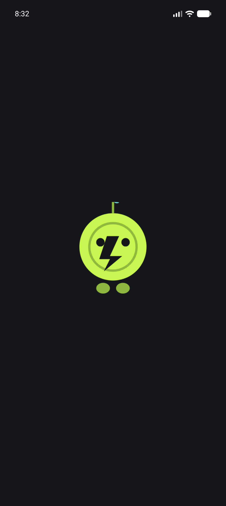
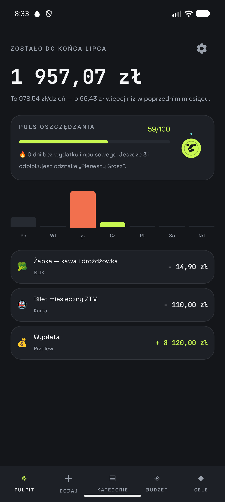
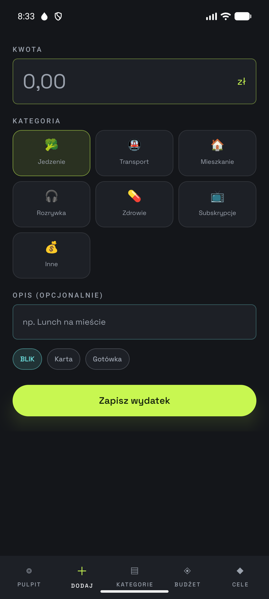
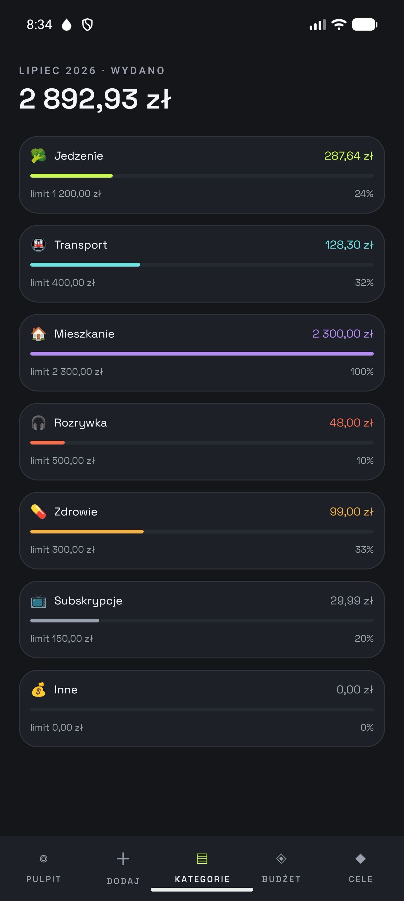
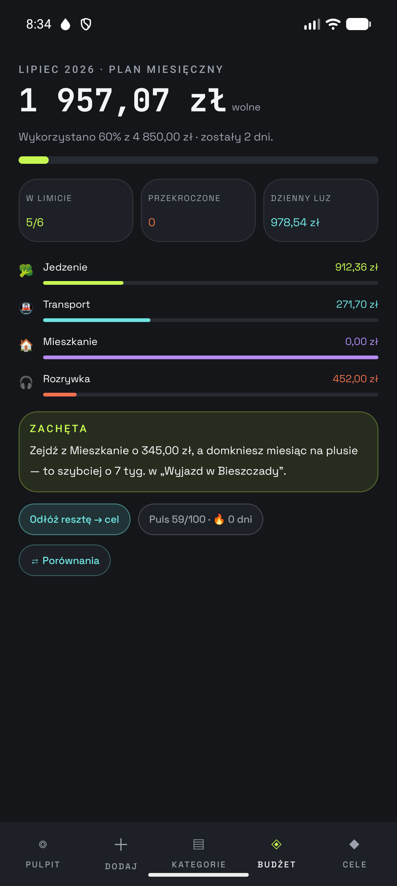
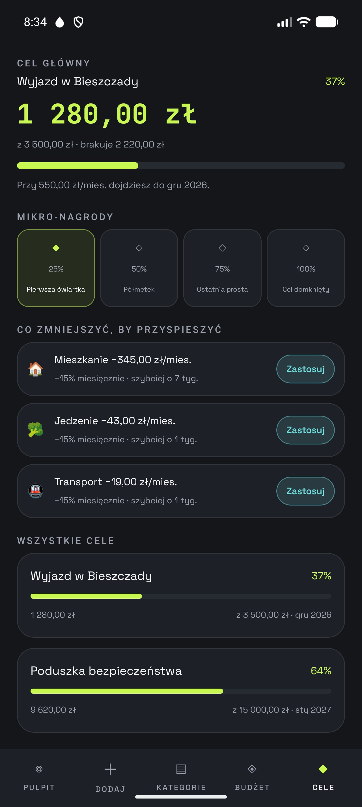
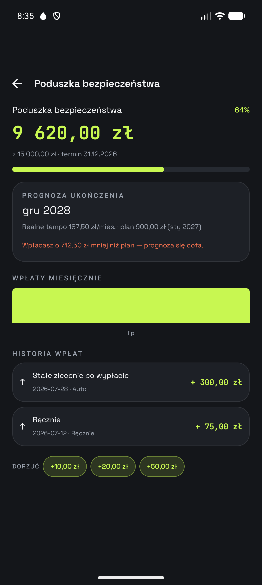
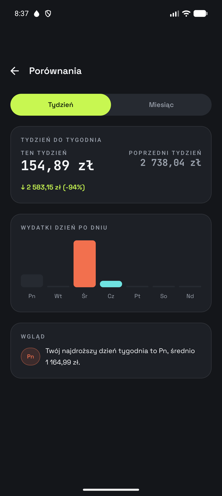
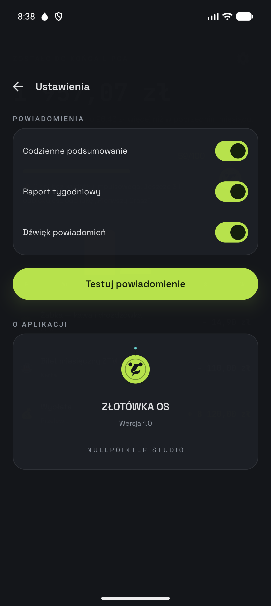

<div align="center">

# ⟨ ZŁOTÓWKA <span>OS</span> ⟩

**future‑minimalizm · budżet osobisty w PLN · natywny Android**

<sub>makieta v0.1 · pl‑PL</sub>

[](android)
[](android)
[](android)
[](android)
[](android)
[](#)

</div>

---

```
> system.boot()
  ██ background   graphite night      #14161A
  ██ accent       neon lime           #C8F751
  ██ savings      cyan                #6FE3E1
  ██ overspend    coral               #F2704E
  ▸ typography    Space Grotesk / JetBrains Mono (tabular)
  ▸ currency      PLN · grosze jako Long, nigdy Double
  ▸ signature     NullPointer Studio
```

## ✦ O projekcie

**ZŁOTÓWKA OS** to aplikacja do śledzenia dochodów i wydatków zaprojektowana pod polską
codzienność — BLIK, Żabka, bilet ZTM, wypłata 10‑tego. Budżet potraktowany jak panel
sterowania: każdy wydatek to zapis w rejestrze, każda zaoszczędzona złotówka to punkt
Pulsu oszczędzania.

Repozytorium ma dwie warstwy:

| Warstwa | Ścieżka | Co to jest |
|---|---|---|
| 🎨 Makieta | [`src/`](src) | Wizualna referencja w TypeScript/React (Lovable) — design system, 6 ekranów, widget |
| 🤖 Aplikacja | [`android/`](android) | Pełnoprawna natywna apka **Kotlin + Jetpack Compose**, zbudowana 1:1 na podstawie makiety |

---

## ▤ Funkcje

- 💸 **Dodawanie wydatków** w 3 dotknięciach — kwota → kategoria → metoda płatności
- 📊 **Kategorie i budżet miesięczny** z paskami limitów i sygnałem przekroczenia
- 🎯 **Cele oszczędnościowe** — mikro‑nagrody 25/50/75/100%, prognoza daty z realnego tempa wpłat
- ✂️ **Sugestie cięć** — „ogranicz Rozrywkę o 60 zł → cel bliżej o 2 tygodnie"
- 🔥 **Puls oszczędzania (0–100)** + serie dni bez wydatku impulsowego + odznaki
- ⇄ **Rozbudowane porównania** — tydzień/tydzień, miesiąc/miesiąc, „najdroższy dzień tygodnia"
- 🔔 **Powiadomienia** z własnym wygenerowanym dźwiękiem — codzienne podsumowanie, raport tygodniowy, odznaki
- 📱 **Widget na ekran główny** (Glance) — pasek dnia 4×2 i puls 2×2 z szybkim BLIK‑iem
- 🪙 **Grosik** — maskotka‑moneta reagująca nastrojem na Twoje oszczędzanie
- 🌌 Splash z ciekawostkami o złotówce i podpisem studia

---

## ◆ Ekrany

<table>
<tr>
<td align="center" width="33%"><br/><sub><b>Splash</b> · Grosik</sub></td>
<td align="center" width="33%"><br/><sub><b>Pulpit</b> · Puls oszczędzania</sub></td>
<td align="center" width="33%"><br/><sub><b>Dodaj</b> · 3 dotknięcia</sub></td>
</tr>
<tr>
<td align="center"><br/><sub><b>Kategorie</b> · limity</sub></td>
<td align="center"><br/><sub><b>Budżet</b> · plan miesięczny</sub></td>
<td align="center"><br/><sub><b>Cele</b> · mikro‑nagrody</sub></td>
</tr>
<tr>
<td align="center"><br/><sub><b>Szczegóły celu</b> · prognoza</sub></td>
<td align="center"><br/><sub><b>Porównania</b> · tydzień/miesiąc</sub></td>
<td align="center"><br/><sub><b>Ustawienia</b> · NullPointer Studio</sub></td>
</tr>
</table>

---

## ◈ Stos technologiczny

```
Kotlin 2.1 · Jetpack Compose (BOM 2024.12) · Material 3
Room 2.6 (grosze jako Long)     ·  Navigation‑Compose
Glance 1.1 (widget)             ·  WorkManager (powiadomienia + odświeżanie widgetu)
DataStore Preferences           ·  Coroutines / Flow
core‑splashscreen               ·  Space Grotesk + JetBrains Mono (tabular figures)
```

**Architektura** (`android/app/src/main/java/pl/nullpointerstudio/zlotowka/`):

```
data/            encje Room, DAO, repozytorium, ustawienia (DataStore)
domain/          czysta logika: PLN, Puls oszczędzania, cele, porównania
ui/              Compose — theme, komponenty, nawigacja, ekrany, splash, maskotka
notifications/   kanały, workery (dzień/tydzień/odznaki), reset po restarcie
widget/          Glance AppWidget + szybki BLIK
```

---

## ⇩ Pobierz

Gotowy build (debug, do sideloadu) znajdziesz w **[Releases →](../../releases)**

```bash
adb install zlotowka-os.apk
```

## ▶ Uruchomienie lokalnie

```bash
cd android
./gradlew assembleDebug
# albo otwórz folder android/ w Android Studio
```

---

<div align="center">
<sub><b>NULLPOINTER STUDIO</b></sub>
</div>
